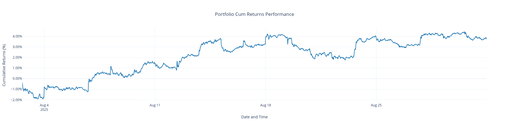

# PAT-Analytics
PAT-Analytics is a python library enabling user to fetch market data, create portfolios, display portfolio metrics : risk, sector allocations, implied growth, stress-tests. Allows access to models, and portfolio optimizers. 
  
# DISCLAIMER  
**THIS TOOL IS STILL IN EARLY DEVELOPMENT AND MAY CONTAIN BUGS, UNFINISHED FEATURES, AND POOR DOCUMENTATION. BE AWARE!**
# Quick Set-Up 
## For Users
If you wish to use the library, make sure to clone the repo and set up a virtual environment
```bash
git clone git@github.com:Quant-Club-UVIC/PAT-Analytics.git
cd PAT-Analytics
python3 -m venv venv
source venv/bin/activate
```
 and then 
```bash
pip3 install -e .
```  
Here is a simple script to get the Conditional-VaR of a portfolio, with data
```python3
data_dir = Path.cwd().parent / "sample-data" # month of August 2025
tickers = ["AAPL", "SPY", "LULU"]

csv_paths = [data_dir / f"{s}.csv" for s in tickers]
market = Market.from_csv(filepaths = csv_paths, date_col= 'epoch', unit='s')
```
Create a Market class, which will hold ALL data regarding the market
```python3
port = Portfolio(market, init_weight='uniform')
strat = BuyNHold()
bt = Backtester(port, market, strat)
bt.run()
```
We initialized a portfolio, and will be using a simple buy and hold strategy (buy at start of period, and do nothing) and then backtest!  
Note: backtester takes into account fees as well, becareful they will eat your gains.
```python3
rr = RiskReport(bt.portfolio, market, resample_freq='D')
print(rr)
```
```bash
RiskReport({
    "time_scale": "custom",
    "confidence_level": 0.95,
    "window": 252,
    "var": 0.008605559410797811,
    "cvar": 0.01344206966134781
})
```
Or if instead we want to look at the portfolio performance
```python3
pr = PerformanceReport(bt.portfolio, market)
pr.plot_returns().show()
```

Of course more complex features can be seen in [/examples](/examples).   
Enjoy!
# Code-Base  
Main source-code is located in pat_analytics/ , the main object *Portfolio* is defined in portfolio.py. If you wish to see how to run our code check out examples/. All of our work-in-progress notebooks and scripts are in work-in-progress/.  
