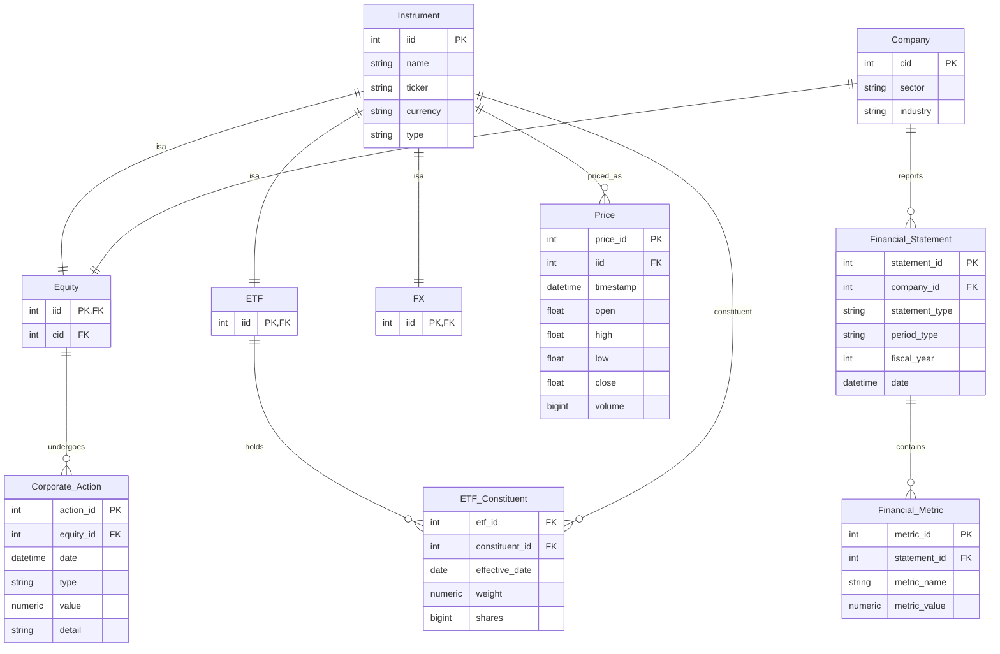

# Main Database ER Diagram  

Notes:  
- In Financial_Statement type can only be one of : Income, CashFlow, Balance  
- In Financial_Statement period_type can only be one of : Q1, Q2, Q3, Q4, FY  
- In Corporate_Action type can only be one of : Divident, BuyBack, Split  
- In Corporate_Action value depends on type, e.g. if there was a 3:1 split, input 3, if there was a 100,000 share buy back, input 100,000, if there was a divident pay out of $1.26 per share, input 1.26. 
- Company should have multiple statements across periods?