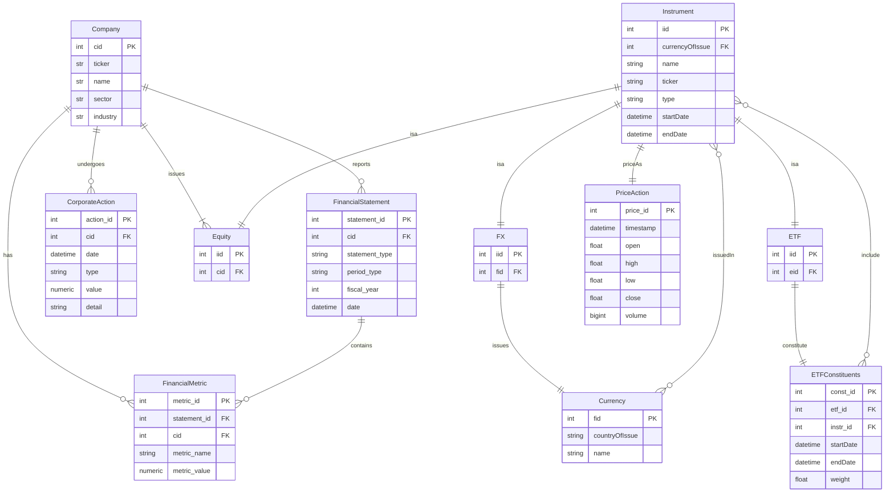

# Database Schema for PAT
A schema for the database warehousing all financial data used in PAT.  

Notes:  
- In FinancialStatement type can only be one of : Income, CashFlow, Balance  
- In FinancialStatement period_type can only be one of : Q1, Q2, Q3, Q4, FY  
- In CorporateAction type can only be one of : Divident, BuyBack, Split  
- In CorporateAction value depends on type, e.g. if there was a 3:1 split, input 3, if there was a 100,000 share buy back, input 100,000, if there was a divident pay out of $1.26 per share, input 1.26. 
- Company should have multiple statements across periods
- Instrument houses all financial instruments which are can be traded on exchanges  
- Instrument tables attribute 'type' can only be on of : 'FX', 'ETF', 'Equity'  
- Note the many to one relationship between Equity and Company, as a company can be listed on many exchanges and trade at different prices (or currency)